# Chapter 30: Voice and Multimodal Agents
## STT, TTS, and the Realtime Gap

**Book:** *Design of Agentic Systems with Case Studies*
**Chapter type:** Type A — Architectural Pattern
**Course:** INFO 7375: Prompt Engineering for Generative AI

**Book master claim:** Architecture is the leverage point, not the model.

**Chapter instance:** VAD failure is an architectural failure. The STT→LLM→TTS pipeline makes it observable and recoverable. Speech-to-speech does not.

**Core claim:** After reading this chapter, a student will understand the STT→LLM→TTS pipeline architecture well enough to make the build-vs-realtime decision for a production voice agent without mistaking a compelling demo for production viability.

---

## Learning Outcomes

**LO1 (Remember):** Name the three pipeline stages and define voice activity detection (VAD) and audio information density.

**LO2 (Understand):** Explain why audio at approximately 1/1000th text information density creates a training data disadvantage for end-to-end voice models.

**LO3 (Apply):** Given a production deployment context, select between pipeline and speech-to-speech architecture using the three-condition framework from this chapter.

**LO4 (Analyze):** Trace the causal chain from VAD mis-segmentation to truncated transcript to incorrect LLM response, identifying where each stage behaved correctly and where the failure originated.

**LO5 (Evaluate):** Assess whether a voice agent demo's architecture can survive production conditions by identifying its VAD observability assumptions.

---

## Section 1: The Scenario

A regional hospital system deploys a voice agent to handle overnight triage calls. The vendor demo runs on a speech-to-speech model: a patient speaks, the system responds within 400 milliseconds, and the conversation feels natural. The procurement team approves it. Three weeks into production, incident reports start arriving.

The agent is interrupting patients mid-sentence. It is responding to partial utterances — "I have a fever and my—" — before the patient finishes. In two documented cases it generated a clinical recommendation based on a hallucinated transcript of what the patient never finished saying.

The root cause is not the language model. The language model is doing exactly what it was trained to do: generate a plausible continuation of the input it received. The root cause is that the input was wrong. Voice activity detection — the component responsible for deciding when a speaker has finished — mis-segmented the audio stream. It sent a truncated utterance to the model. The model never knew the sentence was incomplete.

This is not a bug you patch. It is an architectural decision with a fixed cost structure: speech-to-speech systems make VAD a real-time, low-latency decision at the model boundary. When VAD fails in a pipeline architecture, the failure is detectable and recoverable. When VAD fails in a speech-to-speech system, the failure is already inside the generation loop before any recovery mechanism can act.

This chapter is about that boundary — and the architectural decision that determines whether you can defend it.

---

## Section 2: The Mechanism

To understand why the STT→LLM→TTS pipeline dominates enterprise deployment, you have to understand what the two architectures actually do with audio — not what they claim to do, but what their internal structures require. The distinction is not cosmetic. It determines where decisions get made, at what latency, and whether any given failure can be caught before it propagates.

Begin with what audio actually is as a data type. A spoken sentence lasting four seconds occupies roughly 64,000 samples at 16kHz mono — a stream of amplitude measurements, each one a number between −1 and 1, carrying no explicit lexical structure whatsoever. A transcript of that same sentence might be forty words, or approximately two hundred to two hundred and fifty characters. For every byte encoding phonemic information — the part of the audio signal that carries word identity — roughly a thousand bytes encode prosody, room acoustics, and noise. This matters for training: a model learning from raw audio must extract meaning from a signal that is 99.9% non-lexical. When you train a model on text, every token is signal. When you train a model on raw audio, the ratio of noise to semantic content is approximately three orders of magnitude worse.

This density asymmetry has a concrete consequence for any end-to-end voice model — meaning any model that accepts raw audio directly and emits raw audio directly without explicit intermediate representations. Such a model must learn voice activity detection, phoneme recognition, language understanding, response generation, and speech synthesis simultaneously from a single training objective. The training corpus available for this task is constrained by how much high-quality, multi-turn, transcribed, speaker-labeled conversational audio exists in the world. That corpus is orders of magnitude smaller than the text corpus available for training a language model. Common Voice, a representative large open speech corpus, contains roughly 20,000–30,000 hours of transcribed read speech across all languages — a useful lower bound, though proprietary conversational corpora used in production voice model training are larger and not publicly documented. Even taking the most optimistic estimate of available conversational audio, the gap with text training data remains multiple orders of magnitude. An end-to-end voice model is therefore not simply a language model with ears and a mouth. It is a model trained on a fundamentally impoverished signal, asked to solve a harder joint optimization problem with a fraction of the effective training data.

Voice activity detection — VAD — is the component that decides when a speaker has finished an utterance and generation should begin. VAD algorithms fall into two families: rule-based systems that threshold on directly measurable acoustic energy, and neural classifiers that learn boundary features from labeled data. Their failure modes differ in ways that matter for calibration — rule-based VAD fails predictably at the edges of its threshold, while neural VAD fails unpredictably on out-of-distribution speakers. This distinction becomes consequential in Section 5.

In a speech-to-speech architecture, VAD is not a separable module. An end-to-end voice model is trained on a single objective — predict the correct audio response to the audio input — with no explicit supervision signal for the boundary decision. VAD emerges from the model learning that generating a response before the speaker finishes produces worse outputs on the training set; there is no VAD loss term, no VAD head, and no VAD output that can be separately monitored. The model receives audio, and at some point it decides to begin generating a response. That decision is made inside the forward pass, encoded in the weights, invisible to the pipeline. If the model mis-segments an utterance — if it begins generating before the speaker has finished — there is no architectural seam at which recovery logic can be inserted, because the failure and the generation happen in the same computational step. By the time any downstream component could observe a problem, the generation is already in progress.

In an STT→LLM→TTS pipeline, VAD is structurally external to the language model. It operates on the audio stream before transcription begins. Its output — a segmented audio chunk representing a complete utterance — is the input to the speech-to-text engine. This means VAD operates as a discrete, inspectable gate. You can log every VAD decision. You can set confidence thresholds below which segmentation is held for review. You can implement silence-extension heuristics that hold the gate open when trailing audio energy suggests an incomplete utterance. You can replay the raw audio against a second VAD model when the first one returns a low-confidence boundary. None of these recovery mechanisms are theoretically elegant — they are defensive engineering — but they are possible precisely because the pipeline makes the VAD decision an observable event with an explicit input and an explicit output, rather than an internal state transition of a monolithic model.

The downstream consequence of this structural difference is a failure mode taxonomy that looks completely different between the two architectures. In a speech-to-speech system, VAD failure is silent and immediate: the model receives a truncated utterance, generates a plausible response to it, and emits audio. Nothing in the system has registered that anything went wrong. The language model behaved correctly given its input. The TTS equivalent behaved correctly given the generated text. The failure is invisible at every stage except the one that matters — the patient who just received a clinical recommendation based on a sentence they never finished saying. In an STT→LLM→TTS pipeline, VAD failure is loud and early: the VAD module produces a segmentation boundary, that boundary is logged as a discrete event, the STT engine produces a transcript, and that transcript can be inspected by confidence scoring, by minimum word-count heuristics, by a secondary classifier trained to detect syntactically incomplete utterances, or by a human review queue for low-confidence segments. The failure has a timestamp, a confidence score, an audio file, and a transcript. It can be caught. It can be escalated. It can be corrected before the LLM ever sees it.

This is what it means for an architectural boundary to be observable and interceptable. The pipeline does not prevent VAD from failing. VAD will fail. The question the architect must answer before deployment is whether the failure will be visible when it happens, and whether recovery logic will have a place to stand when it does.

---

## Section 3: The Design Decision

The choice between speech-to-speech and STT→LLM→TTS is not a question of which architecture is better. It is a question of which failure modes your deployment context can tolerate. Answering that question requires a framework precise enough to apply before you have incident reports, not after.

Speech-to-speech is the correct architectural choice under exactly three conditions, and the conjunction matters — all three must hold simultaneously, not merely one or two. The first condition is that latency is the dominant user experience variable and response delay above approximately 500 milliseconds produces measurable user abandonment or task failure. The second condition is that the stakes of a mis-segmented utterance are low enough that an incorrect response imposes no consequential cost on the user — meaning the domain is conversational, the outputs are non-binding, and the user can correct the system without friction. The third condition is that the acoustic environment is controlled, meaning the training distribution of the speech-to-speech model reasonably covers the noise profile of the deployment environment. A consumer voice assistant running on a phone in a quiet room satisfies all three conditions. A hospital triage system running overnight in an ICU satisfies none of them. The reason these conditions rarely hold in enterprise deployment is structural: enterprise voice systems are deployed precisely in the contexts where consequences are high, acoustic environments are unpredictable, and someone — a regulator, a liability insurer, a compliance officer — will eventually ask what the system decided and why. The moment that question becomes answerable from architecture, speech-to-speech loses its viable deployment surface in that context.

The four production signals that indicate the pipeline is the right choice each have a mechanism that connects directly to the architectural properties established in Section 2. The first signal is an auditability requirement. If any stakeholder — internal or external — has the right to request a reconstruction of what the system heard, what it transcribed, what it generated, and what it said, then the architecture must produce those artifacts as discrete, logged outputs. A speech-to-speech system has no transcript, no segmentation log, and no generation trace that can be meaningfully separated from the model weights. A pipeline produces all four as natural byproducts of its stage boundaries. Auditability is not an add-on feature; it is a consequence of having explicit intermediate representations, and only the pipeline has them. The second signal is a noisy acoustic environment. Background noise degrades VAD performance in all architectures, but it degrades end-to-end voice models disproportionately because those models cannot be patched at the VAD layer — they can only be retrained. A pipeline allows you to swap or tune the VAD module independently, apply noise suppression before the STT engine, and set adaptive confidence thresholds at the segmentation boundary without touching the language model. The third signal is domain-specific vocabulary. Medical terminology, legal language, proprietary product names, and technical jargon all appear at negligible frequency in general speech corpora. An STT engine can be fine-tuned on a domain lexicon, or a custom vocabulary layer can be injected at the transcription stage, without retraining the language model. This is possible because the STT engine's vocabulary is an explicit, inspectable data structure — a pronunciation dictionary mapped to beam search priors — not a distributed weight pattern. Swapping it does not disturb any other component. In a speech-to-speech system, domain vocabulary adaptation requires touching the entire model, which means retraining cost scales with model size rather than with vocabulary size. The fourth signal is regulatory or liability exposure. Wherever a system's output can produce a legally or clinically consequential action — a medication recommendation, a financial transaction, a triage classification — the architecture must support the ability to replay, audit, and contest any individual decision. That requires a pipeline. Not because pipelines are more accurate, but because they are more legible, and legibility is what regulators and courts actually require.

The latency cost of the pipeline is real and quantifiable. A competitive STT engine adds approximately 100 to 300 milliseconds of latency on a two-to-four second utterance, depending on whether it operates in streaming or batch mode. The LLM adds first-token latency of 200 to 600 milliseconds depending on model size and infrastructure. The TTS engine adds another 100 to 250 milliseconds before the first audio chunk can begin streaming to the caller. In the worst case, the pipeline introduces roughly one full second of additional latency relative to a speech-to-speech system operating at its theoretical minimum. This is not a trivial number. But it is also not an unmanageable one, and the mechanisms for reducing it are well understood. Streaming STT — processing audio in chunks and emitting partial transcripts as the speaker continues — allows the pipeline to begin LLM inference before VAD has confirmed the utterance boundary, trading a small increase in mis-segmentation risk against a reduction in first-response latency. Note that streaming STT changes the pipeline topology described in Section 2 — VAD and STT now run in parallel rather than in series, with VAD confirming or rejecting a boundary that STT has already begun processing. The Section 2 diagram is the conservative baseline; this is its latency-optimized variant. Speculative TTS — beginning synthesis on the first sentence of the LLM output before generation is complete — further reduces the gap between LLM completion and audible response. The TTS engine subscribes to the LLM token stream and begins synthesis the moment it detects a sentence-terminal punctuation token; the failure mode is a committed audio output whose semantic setup is contradicted by the generation that follows, manageable by buffering one sentence before synthesis begins. Neither technique closes the full latency gap with speech-to-speech, but together they routinely bring pipeline latency within 200 to 400 milliseconds of the end-to-end baseline. In a hospital triage system, in a regulated financial services application, or in any context where a VAD failure carries consequence, that residual latency difference is not the cost of using a pipeline — it is the price of having a recovery mechanism, and it is cheap.

There is a subtler reason the latency argument is less decisive than it first appears. The perceived latency of a voice system is not identical to its measured latency. Acknowledgment tokens work by signaling processing engagement — the user interprets the token as evidence that their utterance was received, which resets the subjective wait clock. Informal user studies suggest this reduces perceived latency by a meaningful margin, with some HCI literature citing figures in the 100–400ms range, though the effect is context-dependent and has not been rigorously characterized for clinical voice applications. Critically, this effect degrades in high-stakes or emotionally elevated conversations, where the user is tracking response content rather than response latency. The hospital triage context in Section 1 is precisely the context where this technique is least reliable. These techniques are architecturally simpler in a pipeline regardless, where the LLM can be prompted to emit an acknowledgment token before beginning substantive generation.

**Architectural rule:** Choose the pipeline whenever a failure requires an explanation, and choose speech-to-speech only when a failure requires nothing more than a retry.

---

## Section 4: The Failure Case

The failure begins in the audio signal before any model sees it. When a speaker pauses mid-sentence — to breathe, to search for a word, to swallow — the acoustic energy in the audio stream drops toward the noise floor for a period typically ranging from 80 to 400 milliseconds. A VAD algorithm, whether rule-based or neural, is trained to interpret sustained energy drops as utterance boundaries. In a well-tuned system, the threshold for declaring a boundary is calibrated to the expected pause distribution of the deployment population. In a mis-calibrated or undertrained system — or in any system encountering a speaker whose pause duration falls in the tail of the training distribution — a 200-millisecond mid-sentence pause is acoustically indistinguishable from a 200-millisecond post-sentence pause. The VAD fires. The audio chunk is closed. The fragment is forwarded to the STT engine.

What arrives at the STT engine is not a malformed audio file. It is a perfectly well-formed audio chunk that happens to contain an incomplete utterance. The STT engine has no mechanism for knowing that the sentence is unfinished, because sentence completeness is a semantic and syntactic property, not an acoustic one. Syntactically complete sentences do not have a unique acoustic signature — the energy decay after "my chest hurts" is physically identical to the energy decay after "my." The difference is in the subsequent audio: a complete sentence is followed by silence; an incomplete one is followed by more speech. But the VAD fires before the subsequent audio arrives, which is the architectural trap. The mechanism is temporal, not spectral. The engine transcribes what it received faithfully and correctly. The transcript it produces — "I have a fever and my" — is an accurate representation of the audio it processed. No component in the pipeline has made an error yet. The error is the boundary decision, which was made upstream, and its consequence has now been encoded into text and passed forward. This is the critical propagation moment: a failure that originated in the time domain of an audio stream has been converted into a lexical artifact, a truncated string, that will be treated by every downstream component as a complete and valid input.

The language model receives that string and does exactly what it was trained to do. It computes the most probable continuation of the input given its training distribution. "I have a fever and my" is a well-formed partial sentence that the model has seen in thousands of variations during training. The probability mass over the next token concentrates heavily on anatomical completions: "chest hurts," "throat is sore," "breathing is difficult." The model selects from that distribution and generates a response. That response is not a hallucination in the sense of fabricating something with no relationship to the input — it is a statistically coherent completion of a prompt the model had no reason to distrust. The LLM receives a string. The VAD confidence score is a floating-point value logged by a different process. Nothing in the standard pipeline design passes that score into the LLM's context window — not because it couldn't be, but because it isn't, by default. The model has no signal that the utterance was truncated. It responds to the transcript it received, and the transcript it received was accurate. The failure has propagated from the VAD boundary through the STT engine and into the LLM without leaving a detectable trace at any stage — unless the pipeline was designed to produce one.

In the notebook that instruments this pipeline, the failure looks like this. When you inject the full utterance — "I have a fever and my chest has been hurting since this morning" — the VAD module returns a boundary confidence score of 0.989, the STT engine produces the complete 13-token transcript, and the LLM generates a response appropriate to the full clinical picture: chest pain and fever together warrant emergency attention. When you inject the truncated utterance — "I have a fever and my" — the VAD module returns a confidence score of 0.346, the STT transcript is six tokens with no syntactic closure, and the LLM responds by asking for more information — a plausible completion of a sentence the patient never finished. The confidence delta between the two cases is 0.643. That delta is the observable signal. It exists in the pipeline. It does not exist in a speech-to-speech system.

This failure is architectural, not incidental, and the architectural argument has two parts. The first part is that the pipeline makes the failure observable. The VAD boundary decision is a logged event with a timestamp, an audio chunk identifier, a confidence score, and a duration. The STT output is a string with a token count and a confidence distribution. The combination of a low VAD confidence score, a short transcript, and an absence of syntactic closure markers is a detectable signature — one that a recovery layer can act on by holding the response, extending the listening window, or escalating to a human. None of this requires the LLM to know anything went wrong. The recovery logic operates at the pipeline boundary, before the LLM is invoked at all. The second part is that a speech-to-speech system cannot produce this failure signature, not because it handles VAD better, but because VAD in that architecture is not a separable event. There is no confidence score to log. There is no boundary timestamp. There is no intermediate transcript. There is only an audio input and an audio output, and by the time the output is audible, the boundary decision that caused the failure is irretrievably embedded in the model's internal activations. You cannot replay it. You cannot threshold it. You cannot route it to a recovery queue. The failure has already become the response.

**To trigger this failure yourself:** Take any working STT→LLM→TTS pipeline and modify the audio preprocessing step to truncate all input utterances at a fixed duration — two seconds is sufficient for most clinical or business sentences — before forwarding to the STT engine. Do not modify the VAD configuration. Do not change the LLM prompt. Do not alter the TTS stage. Simply cut the audio at two seconds and observe what the LLM returns for utterances whose natural completion falls after that boundary. The pipeline will process the truncated input without error. Every stage will behave correctly. The output will be wrong.

---

## Section 5: The Exercise

Open the notebook at Cell 11. You will find a single parameter at the top of the cell: `truncation_s`, currently set to `2.0`. This value controls the point at which the audio preprocessing layer cuts the incoming utterance before forwarding it to the VAD module. Everything else in the pipeline — the VAD confidence threshold, the recovery gate logic, the LLM system prompt, the TTS engine — is unchanged. Your task is to run the cell four times, setting `truncation_s` to `1.5`, `2.0`, `2.5`, and `3.0` in sequence, and to record three observables for each run: the VAD confidence score returned at the boundary, whether the recovery gate returns ESCALATE or FORWARD, and the full text of the LLM response.

At `1.5` seconds, the truncation is aggressive enough that most utterances will be cut inside their first clause. The VAD module will encounter an energy profile that drops sharply at an unnatural point, and the confidence score it returns will reflect the ambiguity of that boundary. The recovery gate will return ESCALATE at this setting for the majority of fixture utterances, and the LLM will never be invoked. That is the recovery mechanism working as designed.

At `2.0` seconds, the failure mode from Section 4 reproduces exactly. The truncation point now falls inside a natural pause region for a meaningful fraction of the fixture utterances — long enough that the VAD module sees an energy dip resembling a genuine boundary, short enough that the sentence is structurally incomplete. The confidence score will be higher than at `1.5` seconds, high enough in some cases to cross the ESCALATE/FORWARD threshold. For those utterances, the gate will return FORWARD, the truncated transcript will reach the LLM, and the LLM will generate a response. Record both the transcript and the response for every case where the gate transitions from ESCALATE to FORWARD. That transition point is the architectural vulnerability — not because the gate malfunctioned, but because it behaved exactly as designed and was wrong.

At `2.5` and `3.0` seconds, a different phenomenon emerges. The truncation point now falls after the natural completion of shorter utterances, and the VAD module returns high-confidence FORWARD decisions for those cases. But for longer utterances whose full syntactic completion requires three or more seconds, the `2.5` and `3.0` second truncations still produce mid-sentence cuts — now with confidence scores that may be higher than at `2.0` seconds, because the energy profile near the end of a long clause can closely resemble the profile near the end of a complete sentence. At `3.0` seconds you may observe the most consequential configuration: a high-confidence FORWARD decision, a grammatically plausible partial transcript, a recovery gate that does not fire, and an LLM response that is internally coherent and clinically specific. This is not a failure that looks like a failure.

Before you read the comparison table Cell 11 renders after the final run, write down your prediction: at which truncation value does the gate transition from predominantly ESCALATE to predominantly FORWARD, and why? After reading the table, determine whether your prediction was correct. If it was not, identify which acoustic property caused the gate to behave differently than you expected. That identification is the analytical move the chapter was building toward.

This chapter has established that the pipeline makes VAD failures observable and interceptable, and that the recovery gate is the architectural mechanism that converts observability into correctness. But the chapter has not fully resolved one question, and you should carry it forward: under what acoustic conditions does the recovery layer itself become the failure point — not because it fails to activate, but because the confidence signal it is thresholding on is systematically misleading for a specific class of speakers, accents, speaking rates, or clinical presentations? A gate calibrated on one population's pause distribution will have a different false-FORWARD rate on another population's. That miscalibration is not a VAD problem. It is not an LLM problem. It is a deployment problem, and it is invisible until the population it affects is the one placing the calls.

---

## Figures

**Core claim illustrated:** The STT→LLM→TTS pipeline is not superior because of model quality, but because it creates an observable boundary where failures can be intercepted. Speech-to-speech architectures eliminate that boundary and therefore eliminate the possibility of recovery.

### Figure 1: Pipeline vs Speech-to-Speech Topology



*In the pipeline, VAD is an explicit, inspectable boundary between audio input and the STT engine. In speech-to-speech, it is embedded inside the model and cannot be intercepted. That structural difference determines whether a failure can be caught.*

**Caption:** "The pipeline externalizes VAD. Speech-to-speech internalizes it. That difference determines whether a failure can be caught."

---

### Figure 2: VAD Failure Causal Chain



*A mid-sentence pause is misclassified as an utterance boundary at step 2. The truncated transcript propagates through the system. Steps 3 and 4 each behave correctly given their input. The failure originates at the boundary and manifests at step 5 — the patient receives a clinical response to a sentence they never finished.*

**Caption:** "Each stage behaves correctly given its input. The failure lives at the boundary, not in the model."

---

### Figure 3: Recovery Gate Decision Logic



*The recovery layer checks three observable pipeline artifacts before invoking the LLM: VAD confidence score, transcript token count, and syntactic closure. For the confirmed notebook run, the truncated utterance fails all three checks simultaneously — confidence 0.346, tokens 6, closure False — and the LLM is not invoked.*

**Caption:** "The recovery gate operates entirely on pipeline artifacts. It requires no changes to the LLM, STT engine, or VAD module. Notebook run values: confidence 0.346, tokens 6, closure False — all three checks fail, LLM not invoked."

---

## Notebook

The demo implementation is in `chapter30_notebook.ipynb`. It requires Python 3.10+ and an OpenAI API key. Run all cells top to bottom. The failure is triggered at Cell 7. The Mandatory Human Decision Node is at Cell 8. The defense architecture is at Cell 10. The reader exercise is at Cell 11.

```bash
pip install -r requirements.txt
export OPENAI_API_KEY=your_key_here
jupyter notebook chapter30_notebook.ipynb
```

**Confirmed output from notebook run:**

| Utterance | VAD confidence | Tokens | Closure | Gate decision |
|---|---|---|---|---|
| Full (2.9s) | 0.989 | 13 | True | FORWARD |
| Truncated (2.05s) | 0.346 | 6 | False | ESCALATE |

Confidence delta: **0.643** — the observable signal the recovery layer acts on.
